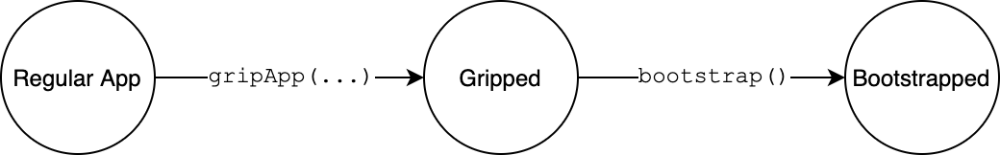

# 🚀 Bootstrapping Your App

In order to start interacting with contracts, you first need to bootstrap your app. After you _grip_ an app, you need to "manually" _bootstrap_ Griptape. This bootstrap process does the following:

1. Initialize a client to make queries to the blockchain
2. Initialize your Account Provider
3. Initialize a client to execute messages to the blockchain

We are going to talk about Account Provider later in this guide, but for now think of it as the software piece in charge of getting a _wallet address_.

Also, it is important to mention that the bootstrap process should be run after you _grip_ your application, and is commonly handled by a component in your UI.

## App States

This diagram represents how the app goes from a **not gripped app** to a **bootstrapped app**:



* **Regular App:** Cannot interact with contracts
* **Gripped:** Can interact with contracts, but the account provider hasn't been initialized (queries that require an **account address** or **viewing key** and **messages** in general can't be called)
* **Bootstrapped:** Messages and queries that require an **account address** or **viewing key** (for queries only) now can be called.

```typescript
import { bootstrap } from '@stakeordie/griptape.js';

// This will bootstrap your app
bootstrap();
```
