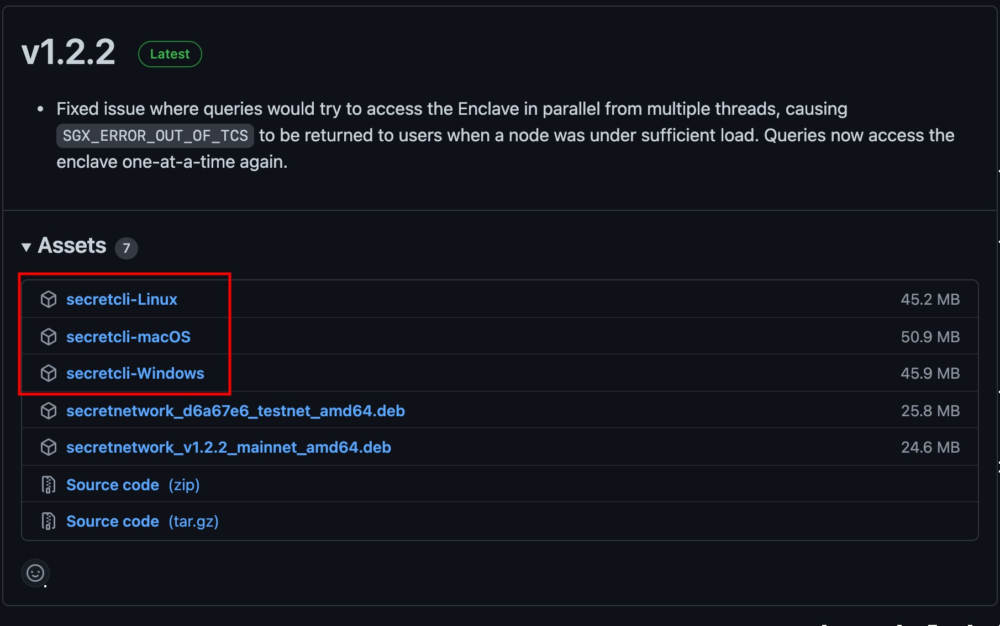

# Getting Set Up

### Getting Started

1. Install Keplr
2. Add `pulsar-2` to Keplr
3. Create an account and send funds using the [faucet](https://faucet.secrettestnet.io)
4. Add custom SNIP-20 tokens to Keplr
5. Install `secretcli` and connect it to `pulsar-2`
6. Instantiate the `auction-factory` contract
7. Create auctions

### Install Keplr

Check out this video to set up you Keplr wallet.



Keep your mnemonic at hand, you will need it later on in this guide.

### Connect to `pulsar-2`

1. In order to connect to the `pulsar-2` chain, go to [https://connect.pulsar.griptapejs.com](https://connect.pulsar.griptapejs.com) and click on the "pulsar-2" button
2. Then a Keplr window will pop up, click on the "approve" button



### Create an account and send funds using the [faucet](https://faucet.secrettestnet.io)

Once you have Keplr installed and an account created, you con now send test tokens to your account. In order to send these tokens you will need to go the the [faucet](https://faucet.secrettestnet.io) and paste your account address there. (There are reports that the faucet may be down, lets us know if you need test SCRT and we will send)



### Add custom SNIP-20 tokens to your wallet

To see all the balances for the custom tokens we have provided you, do the following:

1. Open the Keplr extension
2. Click on the hamburger menu
3. Click on add token
4.  Paste the contract address of the token you want to add and click the "Submit" button

    (All the tokens, and their addresses, are listed in the [Glossary](glossary.md))
5. Click the "approve" button
6. Check that your tokens was added



### Install `secretcli` and connect it to `pulsar-2`

Go to the [Releases Page](https://github.com/scrtlabs/SecretNetwork/releases) of Secret Network [Github](https://github.com/scrtlabs/SecretNetwork) and download the latest version:



Once you have downloaded the binary, save it into a known location for executables. For Linux and Mac users, open a terminal emulator, go to the directory you saved the binary and run the following command:

```shell
chmod +x secretclit-macOS # Or secretcli-linux in case you are in Linux
```

The next step is to rename the binary:

```
mv secretcli-macOS secretcli
```

In order to finish the installation, let's add the binary to our PATH, so we can call it whenever we want. Here are some good resources that tells you how to add it to your path:

* For Linux: [https://linuxize.com/post/how-to-add-directory-to-path-in-linux/](https://linuxize.com/post/how-to-add-directory-to-path-in-linux/)
* For Mac: [https://www.architectryan.com/2012/10/02/add-to-the-path-on-mac-os-x-mountain-lion/](https://www.architectryan.com/2012/10/02/add-to-the-path-on-mac-os-x-mountain-lion/)
* For Windows: [https://www.architectryan.com/2018/03/17/add-to-the-path-on-windows-10/](https://www.architectryan.com/2018/03/17/add-to-the-path-on-windows-10/)

After the installation is complete and you are now able to execute the `secretcli` from your terminal, is time to configure it. Run the following commands to connect it to the `pulsar-2` chain:

```shell
secretcli config broadcast-mode sync
secretcli config node http://rpc.pulsar.griptapejs.com:26657
secretcli config output json
secretcli config chain-id pulsar-2
```

Finally, let's add our account to the `secretcli` command. To do that, you will need your mnemonic. Copy you mnemonic and go to a terminal and run the following command:

```shell
secretcli keys add <a-name> --recover
```

Where:

* `<a-name>` is the name you want you use for your key

You will be asked to paste your mnemonic, then do so.

### Instantiate the `auction-factory` contract

The objective of the instantiation of the factory contract is to get the **contract address** that we are going to use to create auctions.

To instantiate the `auction-factory` contract, run the following command:

```shell
secretcli tx compute instantiate 2496 \
'{"entropy":"QUIza1hNOVlrYVlPQXFuWU00Vmw=","auction_contract":{"code_id":2760,"code_hash":"9D733DD6C613C354A6A86ED62C7839F25C47F942E59F590C6233BD0243D8540C"}}' \
--from <your-key> \
--gas 1000000 \
--label <your-label> -y
```

Where:

* `<your-key>` is the key assigned to you account in the `secretcli`
* `<your-label>` a unique identifier for your instantiated contract. Use whatever it makes sense for you.

The encoded JSON of the init message looks like this:

```json
{
  "entropy":"QUIza1hNOVlrYVlPQXFuWU00Vmw=",
  "auction_contract":{
    "code_id":2760,
    "code_hash":"9D733DD6C613C354A6A86ED62C7839F25C47F942E59F590C6233BD0243D8540C"
  }
}
```

In this case, there's no need for you to edit the values of the JSON.

After you run the command, you will get a response like this:

```json
{
  "height": "0",
  "txhash": "E1D13A11CB08506EF711E33DAFEDFB7BB6DA627C1E2286009905A09C14F05831",
  "codespace": "",
  "code": 0,
  "data": "",
  "raw_log": "[]",
  "logs": [],
  "info": "",
  "gas_wanted": "0",
  "gas_used": "0",
  "tx": null,
  "timestamp": ""
}
```

Take the value of the `txhash` property of the JSON and run the following command, replacing `<my-txhash>` with the value copied before:

```bash
secretcli query compute tx <my-txhash>
```

Finally, we have the contract address of the `auction-factory` at `$.output_logs[0].attributes[0].value`:

```json
{
  "type": "instantiate",
  "input": "efbe0fdfd33254afdd5f3481b171e074a13fe3ebca82c6c2728ec16fb6eca854{\"entropy\":\"QUIza1hNOVlrYVlPQXFuWU00Vmw=\",\"auction_contract\":{\"code_id\":2760,\"code_hash\":\"9D733DD6C613C354A6A86ED62C7839F25C47F942E59F590C6233BD0243D8540C\"}}",
  "output_logs": [
    {
      "type": "wasm",
      "attributes": [
        {
          "key": "contract_address",
          "value": "secret17atn0als6n6n0s8dft0axa78nk5qvjrvdj0825"
        }
      ]
    }
  ]
}
```

### Create auctions

To create auctions you need to do a two step process.

First, you need to run the following transaction:

```shell
secretcli tx compute execute <sell-token-address> \
'{"increase_allowance":{"spender":"<auction-factory-contract>","amount":"1000000"}}' \
--from <your-key> \
--gas 120000 -y
```

Where:

* `<sell-token-address>` an address of a SNIP-20 token that you want to sell. You can use any token in the [Glossary](glossary.md).
* `<your-key-name>` is the key assigned to you account in the `secretcli`

Now, the second step is to create the auction itself. The encoded JSON looks like this:

```json
{
  "create_auction":{
    "label":"<your-unique-auction-label>",
    "sell_contract":{
      "code_hash":"<sell-token-code-hash>",
      "address":"<sell-token-address>"
    },
    "bid_contract":{
      "code_hash":"<bid-token-code-hash>",
      "address":"<bid-token-address>"
    },
    "sell_amount":"<sell-token-amount>",
    "minimum_bid":"<bid-token-minimum-amount>",
    "ends_at":1643698320,
    "description":"This is an optional description"
  }
}
```

Getting the `code_hash` for your tokens is pretty simple:

```bash
secretcli query compute contract-hash <token-address>
```

Where:

* `<token-address>` the contract address of the token you want to get the hash of

And finally, to create a new auction, run the following command for as many tokens you want to:

```shell
secretcli tx compute execute <auction-factory-contract> \
'{"create_auction":{"label":"new-auction-001","sell_contract":{"code_hash":"9587d60b8e6b078ace12014ceeee089530b9fabcd76535d93666a6c127ad8813","address":"secret18vd8fpwxzck93qlwghaj6arh4p7c5n8978vsyg"},"bid_contract":{"code_hash":"cd306596d0c5f43d99b7085c35be615dd2210c0a36bddfb4189b6a54d0906d95","address":"secret1zh5lx269gjjklsz2m32ztt95qcqve37zt3etcx"},"sell_amount":"1000000","minimum_bid":"1000000","ends_at":1643698320,"description":"This is an optional description"}}' \
--from <your-key> \
--gas 630000 -y
```

Where:

* `<auction-factory-contract>` the `auction-factory` contract address obtained in [this step](getting-set-up.md#instantiate-the-auction-factory-contract)
* `<your-key-name>` is the key assigned to you account in the `secretcli`

Lastly you can test that everything is working by querying the auction-factory-contract asking for a list of active auctions

`secretcli q compute query <auction-factory-contract> '{"list_active_auctions":{}}'`

`AND QUERY THE AUCTION DIRECTION WITH`

`secretcli q compute query <auction-contract> '{"auction_info":{}}'`
